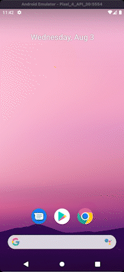

# Desafio Supremo

App criado para mostrar uma lista de extrato bancário consumida de uma API externa. 
Com a ideia de praticar os conhecimentos obtidos até o momento.

## Recursos utilizados

- MVVM
- Retrofit
- Hilt
- Corroutines
- RecyclerView
- ViewBinding

## **Autor - Rodrigo Fernandes**

- Github: [@rodrigoofm](https://github.com/rodrigoofm)
- Linkedin: [https://www.linkedin.com/in/rodrigo-fernandes-melero-197617108/](https://www.linkedin.com/in/rodrigo-fernandes-melero-197617108/)
